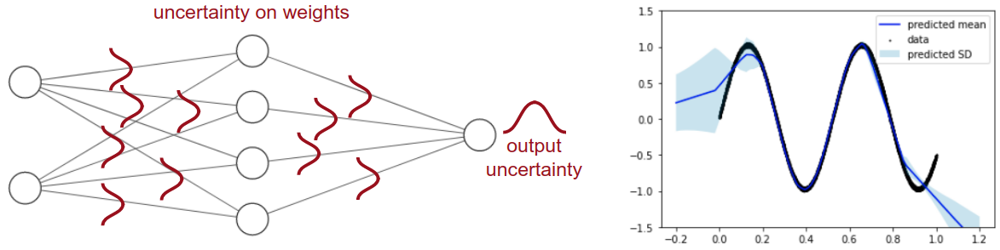

# WUT? - Wrapper for Uncertainty in Tensorflow


* [Documentation](http://abcdchop.github.io/WUT/)
* [Tutorial](WUT_Guide.ipynb)

### Features
Welcome to WUT?! This is a library for uncertainty quantification in deep neural networks implemented in TensorFlow/Keras. Networks can be wrapped in one of the WUT? classes in a single line of code. For instance,
```python
from WUT.Ensemble import Ensemble`
model = Ensemble(<keras_model>)
```

You can estimate both the mean and standard deviation for test inputs.


Available uncertainty quantification models are,

| Model | Type of Uncertainty | Compatible with |
| --- | --- | --- |
| [Ensemble]() | Epistemic | Any network  |
| [MC Dropout]() | Epistemic | Any network  |
| [Variance Netwoorks]() | Epistemic | Fully connected layers only  |
| [Stochastic Variational Inference]() | Epistemic | Fully connected layers only  |
| [Mixture of Gaussians/Mixture Density Networks]() | Aleatoric | Last layer |


### Requirements: 
   `pip install tensorflow (should work for >= v.2.2, tested on v.2.4.1)
   `pip install tensorflow-probability --upgrade`(tested on v.0.12.2)
   `python3 -m pip install keras-mdn-layer`
This library has a dependency on [this](https://github.com/cpmpercussion/keras-mdn-layer) repo. Shoutout to compercussion on github for making the mdn layer, which is extremely good.

### For developers: 
We welcome any contributions. Please make a [pull request](https://help.github.com/articles/using-pull-requests/).. Documents are generated using pdoc3. To install pdoc3 `pip install pdoc3`. To update the ducumentation `pdoc --html WUT --output-dir doc`. You might need to delete the subfolder `WUT/doc/WUT`.

### Maintainers
This library is maintained by [Chris Healy](https://profiles.stanford.edu/christopher-healy) and [Ransalu Senanayake](http://www.ransalu.com/)
